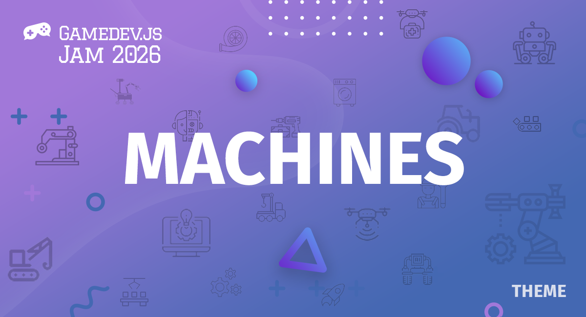
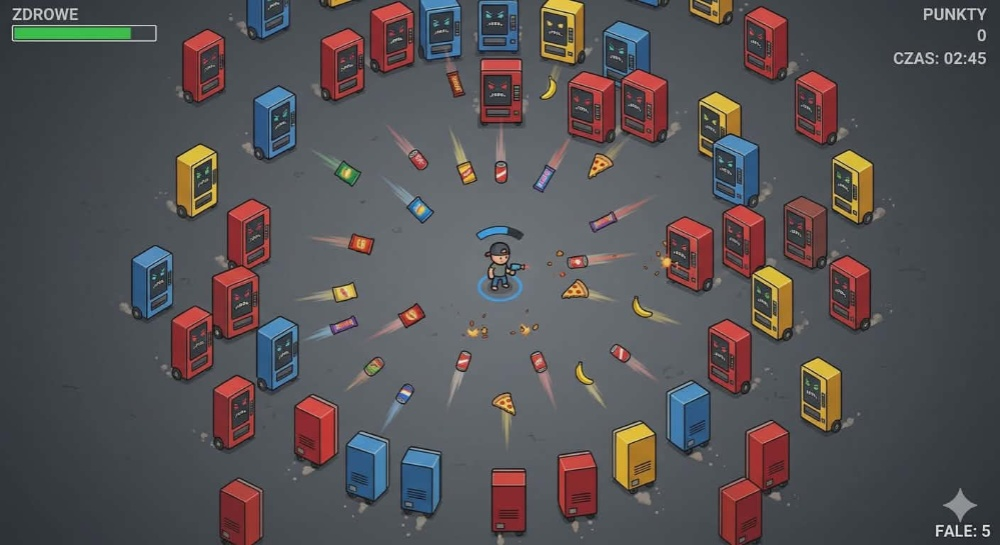
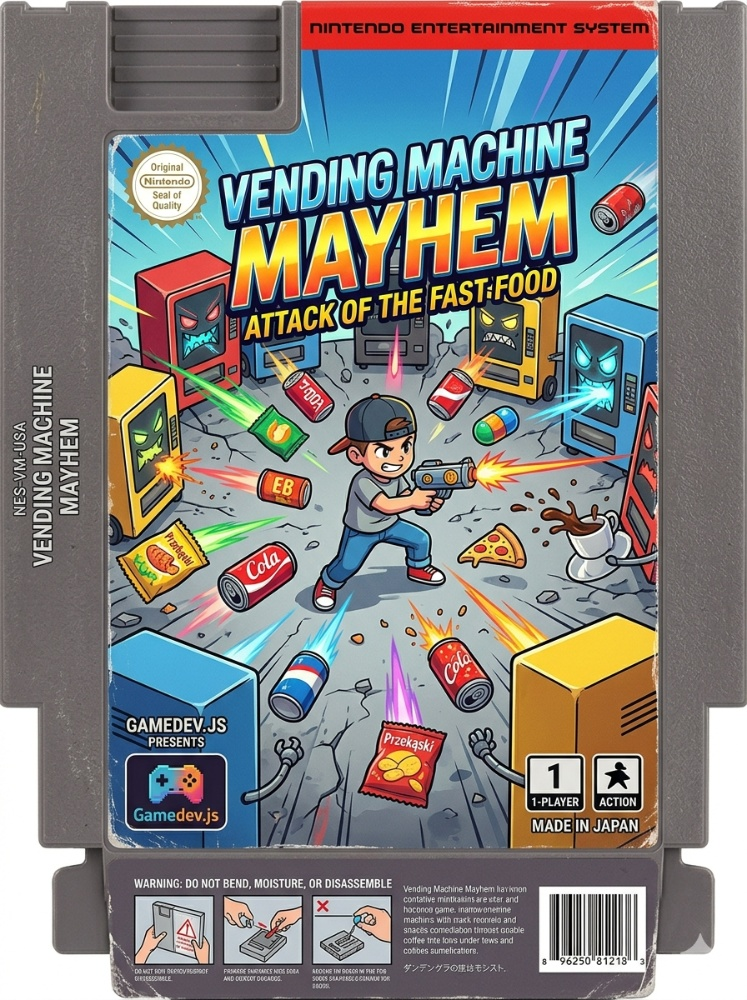

# Gamedev.js Jam 2026 MACHINES

Entry for Gamedev.js Jam 2026 **Machines**

https://itch.io/jam/gamedevjs-2026

https://gamedevjs.com/competitions/gamedev-js-jam-2026-start-and-theme-announcement/

---

# 🥤 Vending Machine Mayhem

> **A high-octane Bullet Heaven survival game for Gamedev.js**

---

## 📋 Game Design Document

### 1. Game Vision
**Vending Machine Mayhem** is a dynamic top-down arena shooter (survival) where the player must survive relentless waves of aggressive vending machines. The game focuses on high-octane chaos, quick reflexes, and the humorous concept of fighting back against "unhealthy snacks."

### 2. Core Loop
* **Defense:** Navigate the open arena to dodge food-based projectiles.
* **Elimination:** Destroy vending machines using coins (ranged) or a crowbar (melee).
* **Upgrade:** Collect "Sugar" dropped by destroyed machines to buy upgrades between waves.
* **Progression:** Survive increasingly difficult waves featuring faster and deadlier machine types.

### 3. Gameplay Mechanics

#### **Movement & Combat**
* **Dash:** A short, burst of speed used to dodge incoming cans or avoid being cornered.
* **Coin Attack:** The player fires coins. Each shot "costs" money (the game's currency acts as ammunition), forcing a balance between offense and saving for upgrades.
* **Knockback:** Getting hit by food pushes the player back, potentially shoving them into a dangerous cluster of enemies.

#### **Enemy Types (Vending Machines)**
| Type | Attack | Behavior |
| :--- | :--- | :--- |
| **Soda Machine** | Fires soda cans in a straight line. | Stationary while firing, then rolls closer to player. |
| **Snack Machine** | Sprays bags of chips (shotgun spread). | Slow movement but very high durability. |
| **Coffee Bot** | Leaves burning puddles of hot coffee. | Circles the player, creating hazardous zones. |
| **Toy Capsule** | Launches small, explosive capsules. | Fast-moving; attempts to ram the player. |

---

### 4. Progression System (Upgrades)
At the end of each wave, the player chooses one of three random power-up cards:
* **Double Shot:** Fire two coins simultaneously.
* **Sugar Rush:** Increases movement speed by 15%.
* **Magnet:** Attracts coins and sugar from a further distance.
* **Recycling:** 20% chance that a fired coin is added back to your wallet.

---

### 5. World Design (The Map)
* **The Arena:** A minimalist gray space (e.g., an empty parking lot or a dark warehouse).
* **Clean Layout:** No static obstacles, allowing the player to focus entirely on bullet-dodging patterns.
* **Dynamic Borders:** Boundaries (like "Caution" tape) shrink as the wave progresses, forcing the player into closer quarters with the machines.

---

### 6. Visuals & Sound
* **Style:** Low-poly 3D or clean 2D Cartoon.
* **VFX:** Destroyed machines erupt in a "fountain" of food items and coins.
* **Audio:** * Mechanical "clunks" and "whirs" for movement.
    * Satisfying "psshhh" (hissing gas) when soda cans are fired.
    * High-energy, retro Synthwave soundtrack.

---

### 7. Win/Loss Conditions
* **Defeat:** The "Health" bar (or "Blood Sugar Level") reaches zero after taking too many hits.
* **Victory:** Survive 10 waves and defeat the Final Boss: **The Industrial Walk-in Freezer**.

## 🎮 Asset Development Tracker

| Category | Asset Name | Description | Status | File Link |
| :--- | :--- | :--- | :---: | :--- |
 **Characters** | Player Sprite Sheet (Boy) | Idle, Walk, Shoot (4 directions) | ✅ Done | [link](./assets/sprites/player_girl.png) |
| **Characters** | Player Sprite Sheet (Girl) | Idle, Walk, Shoot (4 directions) | ✅ Done | [link](./assets/sprites/player_girl.png) |
| **Enemies** | Soda Machine | Enemy: shoots soda cans | ⏳ In Progress | [link](#) |
| **Enemies** | Snack Machine | Enemy: shotgun-style chip spray | ❌ Todo | [link](#) |
| **Enemies** | Coffee Bot | Enemy: leaves hot coffee puddles | ❌ Todo | [link](#) |
| **Enemies** | Toy Capsule | Enemy: fast, explosive capsules | ❌ Todo | [link](#) |
| **Enemies** | Industrial Fridge | Final Boss | ❌ Todo | [link](#) |
| **Projectiles**| Soda Can / Chips | Enemy projectiles | ❌ Todo | [link](#) |
| **Projectiles**| Coin | Player's projectile (ammo) | ❌ Todo | [link](#) |
| **Environment**| Floor Texture | Tileable warehouse/parking texture | ❌ Todo | [link](#) |
| **VFX** | Explosion / Sparkles | Destroyed machine & coin fountain | ❌ Todo | [link](#) |
| **UI/HUD** | Health & Sugar Bar | Main player stats bars | ❌ Todo | [link](#) |
| **UI/HUD** | Upgrade Cards | Icons for: Double Shot, Magnet, etc. | ❌ Todo | [link](#) |
| **UI/HUD** | Title Screen | NES-style retro main menu | ❌ Todo | [link](#) |
| **Audio** | Main Theme | Fast-paced Synthwave track | ❌ Todo | [link](#) |
| **Audio** | SFX Pack | Coin shoot, Can hiss, Explosion | ❌ Todo | [link](#) |

* ✅ Done
* ⏳ In Progress
* ❌ Todo

## 🛠️ Tech Stack

This project is built using modern web technologies to ensure high performance and cross-browser compatibility for the **Gamedev.js** competition.

### **Core Engine & Rendering**
* **[Kontra.js](https://github.com/straker/kontra)** - A lightweight JavaScript gaming micro-library, optimized for js13kGames.

### Assets & Tools
* **Inkscape**

